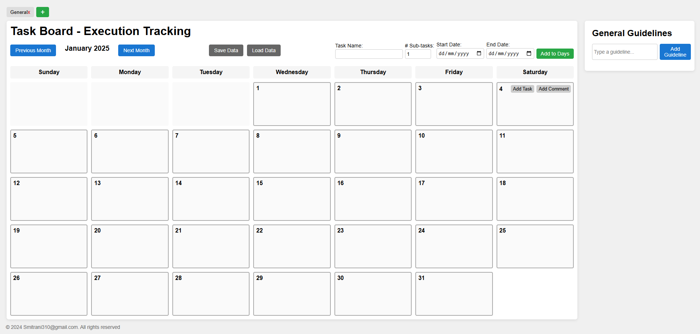

# Multi-Topic Task Board

A lightweight, **browser-based** task management board with support for:
- **Multiple topics** (tabs), each storing its own tasks, comments, and guidelines.  
- **Sub-tasks** (mini-cubes) for each task, with three states: empty → check mark (“✓”) → x (“x”).  
- **Manual data save/load** via JSON.  
- **Guidelines** panel for general instructions.

## Table of Contents
1. [Overview](#overview)  
2. [Features](#features)  
3. [Installation & Setup](#installation--setup)  
4. [Usage](#usage)  
5. [Data Management](#data-management)  
6. [Contributing](#contributing)  
7. [License](#license)

---

## Overview

This **Task Board** application is purely **client-side** JavaScript, HTML, and CSS. The code is self-contained in a single `.html` file, letting you track tasks per day and store data in **localStorage** or export to a `.json` file.

Users can **add new topics** (tabs) to separate different projects/contexts. Each topic has an **independent** set of tasks, comments, and guidelines.

---

## Features

1. **Multiple Topics (Tabs)**  
   - Quickly switch between different categories of tasks (e.g., “Work,” “Personal,” “General”).

2. **Visual Task Board**  
   - Calendar grid for the current month.  
   - Add tasks to specific days, each with sub-tasks (mini-cubes).  
   - Mark sub-tasks with a check (“✓”) or an “x.”

3. **Comments & Guidelines**  
   - Day-specific comments (colored text).  
   - A side panel for general guidelines, also stored per topic.

4. **Save/Load**  
   - **LocalStorage** automatically keeps your data in the browser.  
   - **Manual save** exports a `.json` file.  
   - **Manual load** imports that `.json` file back in.

5. **Multi-Day Task Creation**  
   - Provide a start date and end date to fill tasks automatically across a range.

---

## Installation & Setup

1. **Clone or Download**  
   - Clone this repository or download the `.zip` file and extract it locally.

2. **Open the `.html` file**  
   - No server required. Just open `index.html` (or whichever name you gave it) in a modern browser (Chrome, Firefox, Edge, Safari).

3. **LocalStorage**  
   - The app stores data in your browser’s `localStorage` under the key `topicsData`.  
   - If you want to reset or remove data, you can manually clear the `localStorage` in your dev tools.

4. **Optional**: Use a Simple HTTP Server  
   - If you prefer, run a local server (e.g. `python -m http.server`) to serve the file. Then visit `http://localhost:8000`.

---

## Usage

1. **Add Topics**  
   - Click the **+** (green plus button) at the top-left to create a new topic.  
   - Each topic is a separate “workspace” with its own tasks, comments, and guidelines.

2. **Navigate Months**  
   - Click **“Previous Month”** or **“Next Month”** to change the displayed month.

3. **Add Multi-Day Task**  
   - At the top, fill out the **Task Name**, **# Sub-tasks**, **Start Date**, **End Date**.  
   - Click **“Add to Days”** to populate every day in that range with the new task.

4. **Add Single Task** (inline)  
   - Hover over a specific day cell in the calendar → click **“Add Task”** → fill the short form.  
   - Press **Add** to confirm.

5. **Sub-Task Cubes**  
   - Each task has small cubes representing sub-tasks.  
   - Click a cube to toggle its state: **empty** → check → x → empty.  
   - The task title turns **green** if all are checks; **red** if all are x’s.

6. **Comments**  
   - Hover over a day cell, click **“Add Comment”**, fill out the form (text & color).  
   - Comments appear at the bottom of that day’s cell.

7. **Guidelines**  
   - In the **Guidelines** panel, type a guideline text and click **“Add Guideline.”**  
   - Each guideline can be deleted by hovering over it and clicking **“Delete.”**

8. **Save / Load Data**  
   - **“Save Data”** → exports the entire state as a `myCalendarData.json` file.  
   - **“Load Data”** → imports an existing JSON file, merging or replacing your data.

---

## Data Management

- **LocalStorage**  
  - By default, the application automatically stores all topics (and tasks/comments/guidelines) to your browser’s localStorage on each change.

- **Manual Save**  
  - Use **“Save Data”** to download a `.json` file containing all your topics.

- **Manual Load**  
  - Use **“Load Data”** to import that `.json` file back into the app.

If you want to **reset** completely, you can clear `localStorage` via your browser’s dev tools.

---

## Contributing

1. **Fork** this repository on GitHub.  
2. **Create a feature branch**: `git checkout -b feature/my-new-feature`.  
3. **Commit** your changes: `git commit -m 'Add new feature'`.  
4. **Push** to the branch: `git push origin feature/my-new-feature`.  
5. Open a **Pull Request** in this repository describing your changes.

---

## License

> Distributed under the [Apache 2.0](LICENSE).  
> **© 2024 Smitrani310@gmail.com. All rights reserved.**

---

**Enjoy** your **Multi-Topic Task Board**! If you run into issues, open the **browser console** (F12) for error messages, or post an issue in the repository.  
